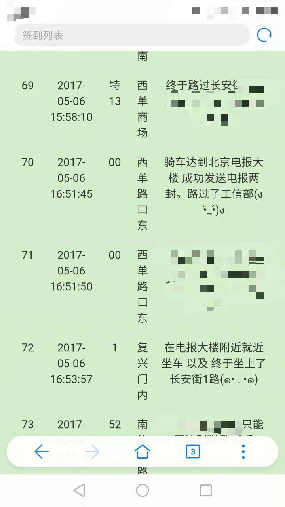

# 公交百站乐

[TOC]

## 前言

这个系统是我在17年4月的一个深夜，在602#用着PHP十分简单的语法和拙劣的技巧，拼凑而成的网站。

虽然它很丑陋，设计也非常粗糙，但是它对于我和我女朋友Rebecca有着十分重要的意义。正是通过当年两次“公交百站乐”的出游的相知和熟悉，我们才能够相爱并走到现在。

这个系统很容易部署而且用起来也很方便，环境要求：> PHP5.6 & Mysql，以及百度地图开发者AccessKey。

（后期有空可能会开发一个通用版）

## 界面设计图

## 灵感来源

- [【亲历游记总结+攻略】北京公交一日游之【百站乐】（多图长文慎入）](http://blog.renren.com/share/234119596/16552442311?from=0101010202&ref=minifeed&sfet=102&fin=4&fid=24041448609&ff_id=234119596&platform=0&expose_time=1385214702)

## 往事纪实

- [23rd Apr 公交百站乐with地主(一)](https://blog.defjia.top/?p=516)
- [6th May 公交百站乐(二)](https://blog.defjia.top/?p=534)

------
纪念Defjia和Rebecca的相知之旅
